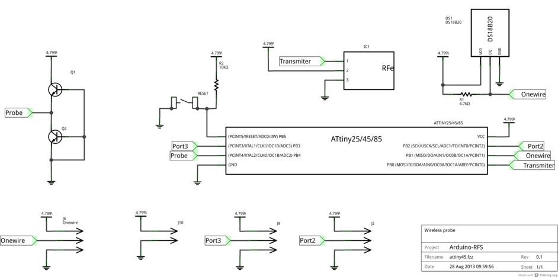
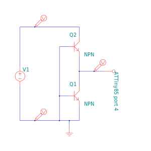
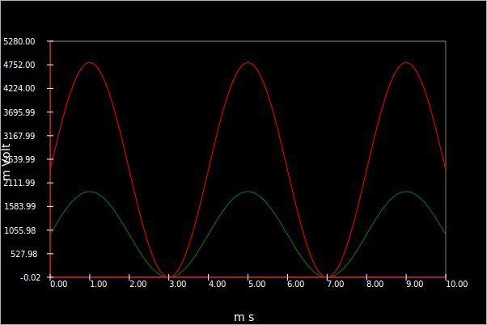
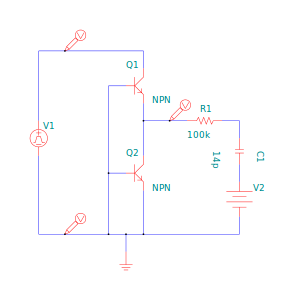
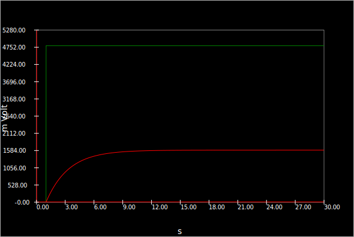
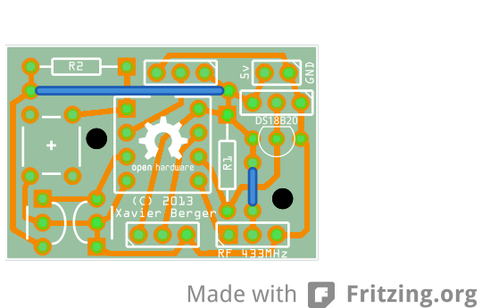

#ATTiny85 module

## Overview
**This assembly is still in development and not ready for production yet but, in association with [RPi-Monitor-LCD](https://github.com/XavierBerger/RPi-Monitor-LCD) and [RPi-Monitor](https://github.com/XavierBerger/RPi-Monitor), it could be a good start for future home automation project.**

This module is designed to get data from Onewire bus or 2 other inpout (port 2 and 3) plus the level of the battery and send it wirelessly through A 433MHz module.

The bus **probe** is dedicate to measure the battery level as described into the next chapter.

## Algorithm for CNY70
The port connected to CNY70 is configured in RAISE interuption mode. This interuption will trigger a callback which will read the previous value of the counter stored into the EEPROM, increment it and store the result is the same memory area.
The main loop awakes every minute and read CNY70 value from the memory and compare it from the last sent value. If a change occurs, it read the ADC to get the battery, read the Onewire temperatur probe and send the three values through 433MHz link then stored the last sent value from CNY70 into the EEPROM. 

## Battery Voltage probe
This module entend to work on battery, it is then important to have a feedback of the remaining power of the battery to let the opportunity to change the batteries before they are empty.

The battery level is then measured by the ADC of ATTiny85. This embedded ADC will compare the voltage set in port 4 an internal reference of 2.56V and return a digital value between 0 and 1024. 

The battery probe is designed to replicate level of the battery (starting for 4.8v and decreasing) in a level compatible with the ADC ( < VCC).

The schema bellow represent the probe:

The battery is simulated by the sinusoidale input V1. The probe will read the voltage between the two transistors.

The following result of simulation is showing that the battery level is reproduced from 1.6V to 0V.

The current available for the ATTiny ADC is very small, few µA. This has the advantage to not empty the battery to measure its level. In counter part, the ADC will react very slowly. This is not a issue since the battery level is also changing very slowly. The schema bellow is representing the ADC equivalent schema as described into [this document](ADC_of_TinyAVR.pdf) (V1=VCC=4.8V, R=100k, C=14pF, V2=VCC/2=2.4V).

The simulation is showing that the ADC will be able to measure the battery level at least 12 seconds after start. This duration is required for the internal capacitor to be fully charged.

When the ADC will be stabilized, it will return the level of the battery following the formula `ADC=(Vin * 1024) / Vref`.
Vref is the internal reference and is equal to 2.56V.

So, when the 4 x AA rechargeable battery (1.2V each) are fully charged (4.8V): ADC = (1.6*1024)/2.56 = 640. Each step of ADC representing 7.5mV.

The value read in the ADC will be stored inside the ATTiny and send unchanged. The Raspberry Pi and **RPi-Monitor** will read this value and convert it to real voltage. Leting the Raspberry Pi doing th job will easily allow the calibration and the conversion from an Interger to Volts.

# PCB

